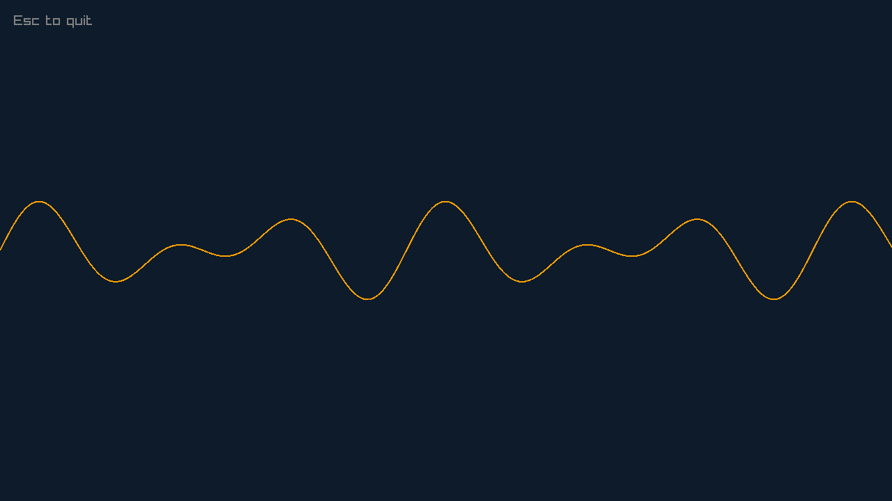

# MotionWave+

[](https://github.com/FuaadBashi/MotionWavePlus/actions/workflows/ci.yml)

A real-time music visualiser in C++20. It plays a WAV, MP3 or FLAC file and draws its waveform
live, built on [raylib](https://www.raylib.com) for graphics and
[miniaudio](https://miniaud.io) for decoding and playback.

<p align="center"></p>

This is the second version of [MotionWave](https://github.com/FuaadBashi/MotionWave). The first
version wires SDL2, raw OpenGL and a hand-written lock-free ring buffer together. This one swaps
all of that for two focused libraries and ends up with a fraction of the code.

## How it works

- **Real-time audio callback.** miniaudio calls `data_callback` on its audio thread whenever the
  device needs samples. The callback decodes straight into the device's buffer and does not
  allocate, print or wait on a lock, the usual causes of audio dropouts. It does decode on that
  thread, which means reading the file. That is fine for a local file; a player reading from slow
  storage would decode ahead on another thread, as the [first version](https://github.com/FuaadBashi/MotionWave)
  does. Past the end of the track it outputs silence.
- **Hand-off to the renderer.** [`SampleExchange`](src/audio/SampleExchange.h) holds the latest
  block of samples. The callback only *tries* its lock: if the renderer is mid-copy, that block is
  skipped rather than making the audio thread wait. A unit test holds the buffer from a
  "renderer" thread and checks that publishing returns immediately. The render loop copies the
  block out and draws from the copy.
- **Testable drawing maths.** `waveformPoints` downmixes stereo to mono and maps samples to
  screen coordinates. It has no raylib dependency and is unit-tested.
- **Resizable window.** The waveform scales to the current window size.

## Build

Requires CMake 3.20+ and a C++20 compiler. raylib is used if installed, otherwise CMake downloads
and builds raylib 5.5 automatically. miniaudio is vendored in `include/`.

```bash
git clone https://github.com/FuaadBashi/MotionWavePlus.git
cd MotionWavePlus
cmake -S . -B build -DCMAKE_BUILD_TYPE=Release
cmake --build build
./build/MotionWavePlus path/to/song.mp3
```

On Linux, raylib needs X11 and OpenGL headers:
`sudo apt install libx11-dev libxrandr-dev libxinerama-dev libxcursor-dev libxi-dev libgl1-mesa-dev`.

## Tests

```bash
ctest --test-dir build --output-on-failure
```
